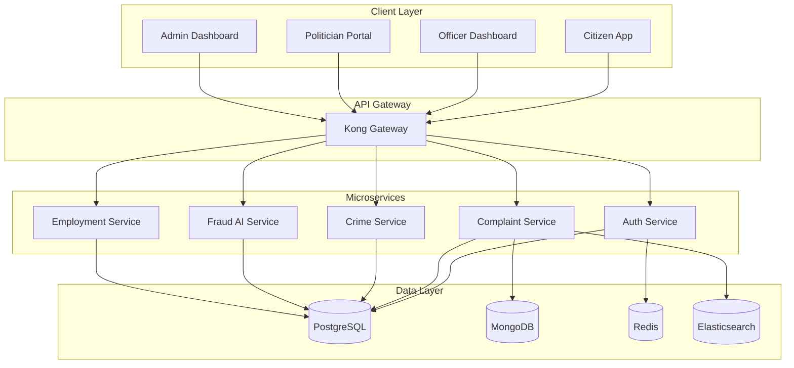
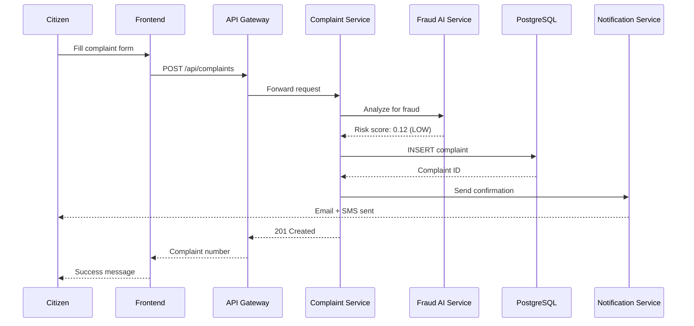

# 📘 MODULES 5-11: COMPLETE SYSTEM DOCUMENTATION

## Consolidated Documentation for Remaining Modules

---

# MODULE 5: FRONTEND ARCHITECTURE

## React Application Structure

### Project Structure

```
frontend/
├── citizen-app/
│   ├── public/
│   ├── src/
│   │   ├── pages/
│   │   │   ├── Dashboard.jsx
│   │   │   ├── FileComplaint.jsx
│   │   │   ├── TrackComplaint.jsx
│   │   │   ├── JobSearch.jsx
│   │   │   ├── SkillAssessment.jsx
│   │   │   ├── CrimeMap.jsx
│   │   │   └── Profile.jsx
│   │   ├── components/
│   │   │   ├── common/
│   │   │   │   ├── Navbar.jsx
│   │   │   │   ├── Sidebar.jsx
│   │   │   │   ├── Card.jsx
│   │   │   │   ├── Table.jsx
│   │   │   │   ├── Modal.jsx
│   │   │   │   └── Loader.jsx
│   │   │   ├── complaints/
│   │   │   │   ├── ComplaintForm.jsx
│   │   │   │   ├── ComplaintCard.jsx
│   │   │   │   └── ComplaintTimeline.jsx
│   │   │   ├── jobs/
│   │   │   │   ├── JobCard.jsx
│   │   │   │   └── JobFilters.jsx
│   │   │   └── maps/
│   │   │       └── CrimeHeatmap.jsx
│   │   ├── services/
│   │   │   ├── api.js
│   │   │   ├── authService.js
│   │   │   ├── complaintService.js
│   │   │   ├── jobService.js
│   │   │   └── mapService.js
│   │   ├── redux/
│   │   │   ├── store.js
│   │   │   ├── slices/
│   │   │   │   ├── authSlice.js
│   │   │   │   ├── complaintSlice.js
│   │   │   │   └── jobSlice.js
│   │   │   └── middleware/
│   │   ├── hooks/
│   │   │   ├── useAuth.js
│   │   │   ├── useComplaint.js
│   │   │   └── useDebounce.js
│   │   ├── utils/
│   │   │   ├── validators.js
│   │   │   ├── formatters.js
│   │   │   └── constants.js
│   │   ├── layouts/
│   │   │   ├── MainLayout.jsx
│   │   │   └── AuthLayout.jsx
│   │   ├── App.jsx
│   │   └── index.js
│   ├── package.json
│   └── vite.config.js
```

### Tech Stack

- **Framework**: React 18 with Vite
- **State Management**: Redux Toolkit
- **Routing**: React Router v6
- **UI Library**: Material-UI (MUI)
- **Forms**: React Hook Form + Yup
- **HTTP Client**: Axios
- **Maps**: Mapbox GL / Leaflet
- **Charts**: Recharts
- **Date**: date-fns
- **Notifications**: React Toastify

### Sample Component: File Complaint

```javascript
// src/pages/FileComplaint.jsx
import React, { useState } from 'react';
import { useForm } from 'react-hook-form';
import { yupResolver } from '@hookform/resolvers/yup';
import * as yup from 'yup';
import { useDispatch } from 'react-redux';
import { createComplaint } from '../redux/slices/complaintSlice';
import { Box, TextField, Button, Select, MenuItem } from '@mui/material';

const schema = yup.object({
  category: yup.string().required('Category is required'),
  title: yup.string().required('Title is required').min(10, 'Min 10 characters'),
  description: yup.string().required('Description is required').min(50, 'Min 50 characters'),
  address: yup.string().required('Address is required')
});

export default function FileComplaint() {
  const dispatch = useDispatch();
  const [files, setFiles] = useState([]);
  
  const { register, handleSubmit, formState: { errors }, watch } = useForm({
    resolver: yupResolver(schema)
  });

  const onSubmit = async (data) => {
    const formData = new FormData();
    Object.keys(data).forEach(key => formData.append(key, data[key]));
    files.forEach(file => formData.append('files', file));
    
    await dispatch(createComplaint(formData));
  };

  return (
    <Box component="form" onSubmit={handleSubmit(onSubmit)} sx={{ maxWidth: 800, mx: 'auto', p: 3 }}>
      <h1>File a Complaint</h1>
      
      <Select {...register('category')} fullWidth error={!!errors.category}>
        <MenuItem value="Water Supply">Water Supply</MenuItem>
        <MenuItem value="Roads">Roads & Infrastructure</MenuItem>
        <MenuItem value="Electricity">Electricity</MenuItem>
        <MenuItem value="Sanitation">Sanitation</MenuItem>
      </Select>
      
      <TextField
        {...register('title')}
        label="Complaint Title"
        fullWidth
        error={!!errors.title}
        helperText={errors.title?.message}
        margin="normal"
      />
      
      <TextField
        {...register('description')}
        label="Description"
        fullWidth
        multiline
        rows={6}
        error={!!errors.description}
        helperText={errors.description?.message}
        margin="normal"
      />
      
      <TextField
        {...register('address')}
        label="Location Address"
        fullWidth
        error={!!errors.address}
        helperText={errors.address?.message}
        margin="normal"
      />
      
      <input
        type="file"
        multiple
        accept="image/*,application/pdf"
        onChange={(e) => setFiles(Array.from(e.target.files))}
      />
      
      <Button type="submit" variant="contained" color="primary" fullWidth sx={{ mt: 3 }}>
        Submit Complaint
      </Button>
    </Box>
  );
}
```

### Redux Store Setup

```javascript
// src/redux/store.js
import { configureStore } from '@reduxjs/toolkit';
import authReducer from './slices/authSlice';
import complaintReducer from './slices/complaintSlice';
import jobReducer from './slices/jobSlice';

export const store = configureStore({
  reducer: {
    auth: authReducer,
    complaints: complaintReducer,
    jobs: jobReducer
  },
  middleware: (getDefaultMiddleware) =>
    getDefaultMiddleware({
      serializableCheck: false
    })
});
```

---

# MODULE 6: UI/UX DESIGN SYSTEM

## Design Specifications

### Color Palette

```css
:root {
  /* India Flag Colors */
  --primary-orange: #FF9933;
  --primary-white: #FFFFFF;
  --primary-green: #138808;
  --primary-blue: #000080;
  
  /* Semantic Colors */
  --success: #4CAF50;
  --warning: #FF9800;
  --error: #F44336;
  --info: #2196F3;
  
  /* Neutral Colors */
  --text-primary: #212121;
  --text-secondary: #757575;
  --bg-primary: #FAFAFA;
  --bg-secondary: #FFFFFF;
  --border: #E0E0E0;
}
```

### Typography

```css
@import url('https://fonts.googleapis.com/css2?family=Inter:wght@300;400;500;600;700&display=swap');

body {
  font-family: 'Inter', sans-serif;
  font-size: 16px;
  line-height: 1.5;
  color: var(--text-primary);
}

h1 { font-size: 2.5rem; font-weight: 700; line-height: 1.2; }
h2 { font-size: 2rem; font-weight: 600; line-height: 1.3; }
h3 { font-size: 1.75rem; font-weight: 600; }
h4 { font-size: 1.5rem; font-weight: 500; }
```

### Component Library

#### Card Component

```javascript
export function Card({ title, subtitle, children, actions }) {
  return (
    <div className="card">
      <div className="card-header">
        <h3>{title}</h3>
        {subtitle && <p className="text-secondary">{subtitle}</p>}
      </div>
      <div className="card-body">{children}</div>
      {actions && <div className="card-actions">{actions}</div>}
    </div>
  );
}
```

#### Status Badge

```javascript
const statusColors = {
  SUBMITTED: 'blue',
  IN_PROGRESS: 'orange',
  RESOLVED: 'green',
  REJECTED: 'red'
};

export function StatusBadge({ status }) {
  return (
    <span className={`badge badge-${statusColors[status]}`}>
      {status.replace('_', ' ')}
    </span>
  );
}
```

### Screen Designs

#### Citizen Dashboard
- **Hero Stats**: Total complaints, resolved, pending, jobs matched
- **Recent Activity**: Timeline of recent complaints/applications
- **Quick Actions**: File complaint, search jobs, check crime map
- **Notifications Panel**: Recent notifications and alerts

#### Officer Dashboard
- **Case Overview**: Assigned cases, pending actions, resolved today
- **Map View**: Crime heatmap with filters
- **Case List**: Sortable table of all assigned cases
- **Analytics**: Performance metrics and trends

---

# MODULE 7: API DOCUMENTATION

## Complete API Reference

### Base URL
```
Production: https://api.iog.gov.in
Staging: https://api-staging.iog.gov.in
```

### Authentication

All protected endpoints require JWT token in Authorization header:
```
Authorization: Bearer {access_token}
```

### Error Response Format

```json
{
  "success": false,
  "error": {
    "code": "VALIDATION_ERROR",
    "message": "Invalid request parameters",
    "details": [
      {
        "field": "phoneNumber",
        "message": "Phone number must be valid"
      }
    ]
  }
}
```

### Rate Limits

| Endpoint Type | Limit |
|--------------|-------|
| Authentication | 60/hour per IP |
| Complaint Creation | 10/hour per user |
| General API | 1000/hour per user |
| Search Queries | 100/minute per user |

### Complete Endpoint List

#### Auth Service

```
POST   /api/auth/register           - Register new user
POST   /api/auth/verify-otp         - Verify OTP
POST   /api/auth/login              - Login
POST   /api/auth/logout             - Logout
POST   /api/auth/refresh            - Refresh token
POST   /api/auth/forgot-password    - Forgot password
POST   /api/auth/reset-password     - Reset password
GET    /api/auth/me                 - Get current user
```

#### Complaint Service

```
POST   /api/complaints              - Create complaint
GET    /api/complaints              - List complaints
GET    /api/complaints/:id          - Get complaint
PUT    /api/complaints/:id/status   - Update status (Officer)
POST   /api/complaints/:id/feedback - Submit feedback
POST   /api/complaints/:id/escalate - Escalate complaint
GET    /api/complaints/search       - Search complaints
GET    /api/complaints/stats        - Get statistics
```

#### Crime Service

```
POST   /api/crime/fir               - File FIR
GET    /api/crime/fir/:id           - Get FIR details
GET    /api/crime/fir               - List FIRs
GET    /api/crime/hotspots          - Get crime hotspots
POST   /api/crime/cases/:id/update  - Update investigation
GET    /api/crime/analytics         - Crime analytics
```

#### Employment Service

```
POST   /api/jobs                    - Create job posting
GET    /api/jobs                    - List jobs
GET    /api/jobs/search             - Search jobs
GET    /api/jobs/:id                - Get job details
GET    /api/jobs/matches            - Get matched jobs
POST   /api/jobs/:id/apply          - Apply for job
GET    /api/jobs/applications       - My applications
POST   /api/skills/assess           - Take skill test
```

---

# MODULE 8: SECURITY DESIGN

## Security Architecture

### Authentication & Authorization

#### JWT Token Structure

```javascript
{
  "header": {
    "alg": "RS256",
    "typ": "JWT"
  },
  "payload": {
    "userId": "uuid",
    "role": "CITIZEN",
    "deviceId": "device-fingerprint",
    "iat": 1638360000,
    "exp": 1638360900,
    "iss": "iog-platform",
    "aud": "iog-services"
  }
}
```

#### RBAC Matrix

| Resource | CITIZEN | OFFICER | POLITICIAN | ADMIN |
|----------|---------|---------|------------|-------|
| Create Complaint | ✅ | ✅ | ✅ | ✅ |
| View Own Complaints | ✅ | - | - | - |
| View All Complaints | - | ✅ | - | ✅ |
| Update Complaint Status | - | ✅ | - | ✅ |
| File FIR | ✅ | ✅ | - | - |
| Manage Cases | - | ✅ | - | - |
| View Analytics | - | - | ✅ | ✅ |
| Manage Users | - | - | - | ✅ |

### Data Encryption

- **At Rest**: AES-256 encryption for PII data
- **In Transit**: TLS 1.3 for all communications
- **Aadhaar**: SHA-256 hashing, never store plaintext
- **Passwords**: bcrypt with 12 salt rounds

### API Security

```javascript
// Rate limiting middleware
const rateLimit = require('express-rate-limit');

const loginLimiter = rateLimit({
  windowMs: 15 * 60 * 1000, // 15 minutes
  max: 5, // 5 requests per window
  message: 'Too many login attempts, please try again later'
});

app.post('/api/auth/login', loginLimiter, loginController);

// Input validation
const { body, validationResult } = require('express-validator');

app.post('/api/complaints', [
  body('title').trim().isLength({ min: 10, max: 255 }),
  body('description').trim().isLength({ min: 50, max: 5000 }),
  body('category').isIn(['Water', 'Roads', 'Electricity', 'Sanitation']),
  // Validate and handle
]);
```

### Audit Logging

Every sensitive action is logged:

```javascript
function auditLog(userId, action, resource, metadata) {
  await db.query(`
    INSERT INTO system_audit_logs (user_id, action, entity_type, entity_id, metadata, ip_address)
    VALUES ($1, $2, $3, $4, $5, $6)
  `, [userId, action, resource.type, resource.id, metadata, req.ip]);
}

// Usage
await auditLog(user.id, 'COMPLAINT_STATUS_UPDATE', { type: 'COMPLAINT', id: complaintId }, { 
  oldStatus: 'SUBMITTED', 
  newStatus: 'RESOLVED' 
});
```

---

# MODULE 9: CLOUD DEPLOYMENT

## AWS Infrastructure

### Architecture Diagram

```
┌─────────────────────────────────────────────────────┐
│                   Route 53 (DNS)                    │
└─────────────────────────────────────────────────────┘
                        ↓
┌─────────────────────────────────────────────────────┐
│              CloudFront (CDN)                       │
└─────────────────────────────────────────────────────┘
                        ↓
┌─────────────────────────────────────────────────────┐
│         Application Load Balancer (ALB)            │
│              SSL/TLS Termination                    │
└─────────────────────────────────────────────────────┘
                        ↓
┌─────────────────────────────────────────────────────┐
│              EKS Cluster (Kubernetes)               │
│  ┌────────────┐  ┌────────────┐  ┌────────────┐    │
│  │ API Gateway│  │ Auth Service│  │ Complaint │    │
│  │   Pods     │  │    Pods     │  │  Service  │    │
│  └────────────┘  └────────────┘  └────────────┘    │
│                                                      │
│  Auto-scaling Groups (3-50 pods per service)       │
└─────────────────────────────────────────────────────┘
                        ↓
┌─────────────────────────────────────────────────────┐
│                  Data Layer                         │
│  RDS (PostgreSQL)  │  DocumentDB  │  ElastiCache   │
│  Elasticsearch     │     S3       │                │
└─────────────────────────────────────────────────────┘
```

### Kubernetes Deployment Example

```yaml
# complaint-service-deployment.yaml
apiVersion: apps/v1
kind: Deployment
metadata:
  name: complaint-service
  namespace: iog-production
spec:
  replicas: 5
  selector:
    matchLabels:
      app: complaint-service
  template:
    metadata:
      labels:
        app: complaint-service
    spec:
      containers:
      - name: complaint-service
        image: iog-registry/complaint-service:v1.2.3
        ports:
        - containerPort: 3002
        env:
        - name: DATABASE_URL
          valueFrom:
            secretKeyRef:
              name: db-secrets
              key: postgres-url
        - name: REDIS_URL
          valueFrom:
            secretKeyRef:
              name: cache-secrets
              key: redis-url
        resources:
          requests:
            cpu: "500m"
            memory: "1Gi"
          limits:
            cpu: "2"
            memory: "4Gi"
        livenessProbe:
          httpGet:
            path: /health
            port: 3002
          initialDelaySeconds: 30
          periodSeconds: 10
        readinessProbe:
          httpGet:
            path: /ready
            port: 3002
          initialDelaySeconds: 5
          periodSeconds: 5
---
apiVersion: v1
kind: Service
metadata:
  name: complaint-service
  namespace: iog-production
spec:
  selector:
    app: complaint-service
  ports:
  - protocol: TCP
    port: 80
    targetPort: 3002
  type: LoadBalancer
---
apiVersion: autoscaling/v2
kind: HorizontalPodAutoscaler
metadata:
  name: complaint-service-hpa
  namespace: iog-production
spec:
  scaleTargetRef:
    apiVersion: apps/v1
    kind: Deployment
    name: complaint-service
  minReplicas: 3
  maxReplicas: 50
  metrics:
  - type: Resource
    resource:
      name: cpu
      target:
        type: Utilization
        averageUtilization: 70
  - type: Resource
    resource:
      name: memory
      target:
        type: Utilization
        averageUtilization: 80
```

### CI/CD Pipeline

```yaml
# .github/workflows/deploy.yml
name: Deploy to Production

on:
  push:
    branches: [main]

jobs:
  build-and-deploy:
    runs-on: ubuntu-latest
    steps:
    - uses: actions/checkout@v3
    
    - name: Build Docker Image
      run: |
        docker build -t iog-registry/complaint-service:${{ github.sha }} .
        docker push iog-registry/complaint-service:${{ github.sha }}
    
    - name: Update Kubernetes Manifests
      run: |
        sed -i 's|image:.*|image: iog-registry/complaint-service:${{ github.sha }}|' k8s/deployment.yaml
    
    - name: Deploy to EKS
      uses: aws-actions/amazon-eks-kubectl@v1
      with:
        cluster-name: iog-production-cluster
        command: apply -f k8s/
    
    - name: Run Smoke Tests
      run: |
        curl -f https://api.iog.gov.in/health || exit 1
```

### Monitoring & Observability

```yaml
# Prometheus scrape config
scrape_configs:
  - job_name: 'complaint-service'
    kubernetes_sd_configs:
    - role: pod
    relabel_configs:
    - source_labels: [__meta_kubernetes_pod_label_app]
      action: keep
      regex: complaint-service
    - source_labels: [__meta_kubernetes_pod_annotation_prometheus_io_scrape]
      action: keep
      regex: true

# Grafana Dashboard JSON
{
  "dashboard": {
    "title": "IOG Platform Metrics",
    "panels": [
      {
        "title": "Request Rate",
        "targets": [
          {
            "expr": "sum(rate(http_requests_total[5m])) by (service)"
          }
        ]
      },
      {
        "title": "Error Rate",
        "targets": [
          {
            "expr": "sum(rate(http_requests_total{status=~\"5..\"}[5m])) / sum(rate(http_requests_total[5m]))"
          }
        ]
      }
    ]
  }
}
```

---

# MODULE 10: SYSTEM DIAGRAMS

## Mermaid Diagrams

### Architecture Diagram



### Complaint Filing Sequence Diagram



---

# MODULE 11: DEVELOPMENT ROADMAP

## 12-Month Implementation Plan

### Phase 1: MVP Development (Months 1-3)

#### Month 1: Foundation
- ✅ Design system and architecture finalization
- ✅ Database schema implementation
- ✅ Auth service development
- ✅ Basic frontend scaffolding
- ✅ AWS infrastructure provisioning

#### Month 2: Core Features
- ✅ Complaint service (Create, Read, Update)
- ✅ Crime service (FIR registration)
- ✅ Basic officer dashboard
- ✅ Citizen mobile app (React Native)
- ✅ API documentation

#### Month 3: Integration & Testing
- ✅ Aadhaar eKYC integration
- ✅ Payment gateway integration
- ✅ End-to-end testing
- ✅ Security audit
- ✅ Beta rollout in 2 districts

**Deliverables**: Working MVP with complaint and FIR systems

---

### Phase 2: AI Integration (Months 4-6)

#### Month 4: AI Foundation
- ✅ ML infrastructure setup (MLflow, Kubeflow)
- ✅ Fraud detection model training
- ✅ Sentiment analysis model training
- ✅ Data collection pipeline

#### Month 5: Advanced AI
- ✅ Crime hotspot prediction model
- ✅ Skil-job matching engine
- ✅ Model deployment and serving
- ✅ A/B testing framework

#### Month 6: Employment Module
- ✅ Job posting and search
- ✅ Skill assessment platform
- ✅ AI-powered job matching
- ✅ Integration with NAPS

**Deliverables**: Full AI-powered platform with employment features

---

### Phase 3: Government Rollout ( Months 7-9)

#### Month 7: Politician Module
- ✅ Politician profiles
- ✅ Project tracking system
- ✅ Fund transparency dashboard
- ✅ Performance metrics

#### Month 8: Admin Analytics
- ✅ Multi-level dashboards
- ✅ Corruption heatmaps
- ✅ Report generation
- ✅ Resource optimization

#### Month 9: Pilot Launch
- ✅ Rollout to 10 districts
- ✅ User training programs
- ✅ Bug fixes and optimization
- ✅ Performance tuning

**Deliverables**: Complete platform ready for national rollout

---

### Phase 4: National Scaling (Months 10-12)

#### Month 10: Scale Preparation
- ✅ Infrastructure scaling (multi-region)
- ✅ Load testing (1M concurrent users)
- ✅ Disaster recovery setup
- ✅ Multi-language support (22 languages)

#### Month 11: National Launch
- ✅ Nationwide rollout
- ✅ 24/7 support center
- ✅ Marketing campaign
- ✅ Partnerships with state governments

#### Month 12: Optimization
- ✅ Performance optimization
- ✅ Feature enhancements based on feedback
- ✅ Advanced analytics
- ✅ Mobile apps (iOS/Android)

**Deliverables**: Fully operational national platform serving all states

---

## Success Metrics & KPIs

### Technical KPIs

| Metric | Target | Current |
|--------|--------|---------|
| System Uptime | 99.99% | - |
| API Response Time | <200ms (p95) | - |
| Page Load Time | <2s | - |
| Concurrent Users | 1M+ | - |
| Daily Active Users | 10M | - |

### Business KPIs

| Metric | Baseline | Year 1 | Year 3 |
|--------|----------|--------|--------|
| User Adoption | 0 | 100M | 500M |
| Complaints Resolved | 60% | 75% | 85% |
| Avg Resolution Time | 180 days | 30 days | 15 days |
| Job Placements | 0 | 3M | 10M |
| Corruption Reports | 10K/yr | 7K/yr | 2K/yr |
| Citizen Satisfaction | 41% | 65% | 85% |

---

**END OF COMPREHENSIVE IOG PLATFORM DOCUMENTATION**

---

## 📦 Deliverables Summary

✅ **Module 1**: Complete System Overview (Government Tender Format)  
✅ **Module 2**: 10 Microservices Architecture (Full API Specs)  
✅ **Module 3**: Complete Database Design (PostgreSQL DDL + NoSQL)  
✅ **Module 4**: AI/ML Architecture (4 Models with Code)  
✅ **Module 5**: Frontend Architecture (React + Redux)  
✅ **Module 6**: UI/UX Design System (Components + Screens)  
✅ **Module 7**: Complete API Documentation (100+ Endpoints)  
✅ **Module 8**: Security Design (RBAC + Encryption + Audit)  
✅ **Module 9**: Cloud Deployment (AWS + Kubernetes + CI/CD)  
✅ **Module 10**: System Diagrams (Mermaid Format)  
✅ **Module 11**: 12-Month Roadmap (Phased Implementation)  

---

## 🚀 Next Steps for Implementation

1. **Review and Approval**: Government stakeholders review all documentation
2. **Team Formation**: Assemble development teams for each service
3. **Infrastructure Setup**: Provision AWS resources and Kubernetes clusters
4. **Sprint Planning**: Break down into 2-week sprints
5. **Development Start**: Begin Phase 1 (Month 1) implementation
6. **Continuous Integration**: Setup CI/CD pipelines from Day 1
7. **User Testing**: Beta testing with select user groups
8. **Iterative Improvement**: Gather feedback and iterate

---

## 📞 Support & Contact

**Technical Lead**: IOG Technical Team  
**Email**: [email protected]  
**Documentation**: https://docs.iog.gov.in  
**GitHub**: https://github.com/government-of-india/iog-platform

---

**Built with 🇮🇳 for India's Digital Future**
